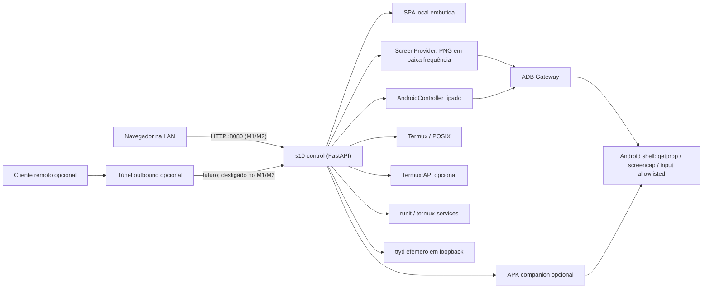

# Arquitetura do S10 Control Server

- **Status:** M2 estabilizado após deploy real; runtime pelo ADR 0002, slice
  ADB/PNG/controle pelo ADR 0003, compatibilidade M2.1 pelo ADR 0004, lease pela
  ADR 0005 e apresentação atômica pela ADR 0006
- **Estilo:** monólito modular, hexagonal/ports-and-adapters, local-first

## 1. Decisão principal

O sistema terá um único backend principal Python/FastAPI executado no Termux.
Ele serve uma SPA React/TypeScript compilada localmente e coordena providers
locais. ADB, captura, controle Android, Termux:API, `ttyd`, runit e túnel são
dependências opcionais, nunca partes do núcleo.

Essa topologia minimiza processos-filho, memória, coordenação e superfície de
falha no Android 12. Microserviços, containers, systemd e banco nativo foram
descartados.



## 2. Princípios

1. **LAN primeiro:** o servidor local é o produto; túnel é apenas transporte
   adicional.
2. **Núcleo independente:** liveness, autenticação, UI e configuração iniciam
   sem ADB, companion, Internet ou túnel.
3. **Capability-driven:** suporte teórico e disponibilidade atual são dimensões
   diferentes.
4. **Providers substituíveis:** toda integração está atrás de um port pequeno e
   testável.
5. **Deny by default:** comandos tipados, allowlists, roots e serviços
   explícitos.
6. **Resultado verificável:** “processo saiu 0” não equivale a “estado mudou”.
7. **Poucos processos:** subprocessos são curtos ou sidecars supervisionados e
   limitados.
8. **Sem reparo destrutivo:** recuperação nunca reinicia o aparelho, revoga ADB,
   desliga rede/SSH ou altera Android crítico.

## 3. Processos e limites de confiança

### 3.1 Processo principal

`s10-control` contém:

- HTTP(S), autenticação e API;
- UI estática embutida;
- registro de capacidades;
- gerenciador de operações e eventos;
- policy engine e auditoria;
- módulos/adapters descritos abaixo.

Ele roda como o UID comum do Termux, sem capabilities Linux adicionais.

### 3.2 Sidecars permitidos

- `sshd`: canal de recuperação existente, totalmente independente e protegido;
- `ttyd`: criado sob demanda somente para o console allowlisted do projeto, em
  loopback; nunca inicia um shell irrestrito;
- `s10-tunnel`: reverse SSH ou cloudflared, opcional e supervisionado;
- `adb`: server/client do pacote `android-tools`, somente quando o provider ADB
  estiver configurado; o projeto não gerencia `adbd`, pareamento, conexão ou o
  lifecycle global do adb server;
- `ffmpeg`: experimento futuro e sob demanda; não pertence ao M2.

Cada sidecar tem timeout, limite de restart e health próprio. A queda de um não
reinicia o telefone nem o processo principal.

“Independente” aqui significa que o lifecycle do projeto não controla `sshd`.
Não é garantia contra o Android: uma morte do app/UID Termux pode derrubar tanto
o servidor quanto SSH, e runit/Boot são somente recuperação best-effort.

### 3.3 APK companion opcional

Um futuro `s10-companion` Android pode oferecer dois serviços independentes:

- `MediaProjection` como ScreenProvider, sempre com consentimento exigido pelo
  Android e foreground notification;
- `AccessibilityService` como AndroidController, habilitado manualmente pelo
  usuário.

O companion não é privilegiado, não recebe root e não é necessário para o
backend. Ele conversa por WebSocket autenticado em `127.0.0.1`, com token local
provisionado e challenge/response. Perder o companion apenas remove suas
capacidades. MediaProjection não inicia silenciosamente após reboot.

## 4. Camadas do backend

| Camada | Responsabilidade | Não pode fazer |
|---|---|---|
| Transport | HTTP(S), SSE, WebSocket, limites, serialização | chamar binários ou Android diretamente |
| Auth/Policy | identidade, papéis, CSRF/origin, allowlists, guardrails | confiar em validação apenas do frontend |
| Application | casos de uso, operações, deadlines, idempotência | conhecer sintaxe de CLI de provider |
| Domain | capacidades, estados, erros, métricas, eventos | importar packages de infraestrutura |
| Ports | contratos de ADB, screen, controller etc. | conter regra específica de fornecedor |
| Adapters | `adb`, POSIX, Termux:API, runit, ttyd, túnel | expor shell arbitrário ao transport |
| Store | configuração, estado, auditoria, retenção | persistir segredos em log ou root editável |

Dependências apontam para dentro: adapter implementa port; domain não conhece
adapter.

## 5. Modelo comum de capacidades

O registro nunca mistura “é possível nesta plataforma?” com “está funcionando
agora?”. O contrato lógico é:

```go
type SupportClass string // guaranteed, probable, experimental, privileged_required
type RuntimeState string // ready, degraded, unavailable, permission_required,
                         // misconfigured, unsupported, unknown

type CapabilityReport struct {
    ID           string
    Support      SupportClass
    State        RuntimeState
    ReasonCode   string
    Detail       string
    Dependencies []string
    ObservedAt   time.Time
    LastSuccess  *time.Time
    RetryAfter   *time.Time
    Stale        bool
}

type Provider interface {
    Probe(context.Context) CapabilityReport
}
```

Exemplo: `screen.snapshot.adb` pode ter suporte `probable` e estado atual
`unavailable` com causa `ADB_OFFLINE`. Reclassificação para `guaranteed` só
ocorre com evidência repetível no SM-G975F registrada em `STATUS.md`; mudança de
estado ocorre em runtime.

## 6. Operações, eventos e erros

Comandos alteradores são assíncronos e auditáveis:

```text
accepted -> queued -> running -> succeeded
                              -> failed
                              -> unsupported
                              -> unverified
                              -> cancelled
                              -> timed_out
```

Toda operação inclui `operationId`, ator, papel, origem, tipo, alvo lógico,
deadline, idempotency key e timestamps. O adapter devolve evidência de execução;
o caso de uso executa uma leitura posterior quando houver estado observável.

Códigos de erro estáveis:

- `UNAVAILABLE`
- `NOT_SUPPORTED`
- `PRIVILEGE_REQUIRED`
- `PERMISSION_REQUIRED`
- `UNAUTHORIZED`
- `FORBIDDEN`
- `POLICY_BLOCKED`
- `INVALID_STATE`
- `STALE_FRAME`
- `TIMEOUT`
- `DEPENDENCY_MISSING`
- `TARGET_MISMATCH`
- `UNVERIFIED`
- `INTERNAL`

Erros externos são sanitizados; stderr completo fica somente em log local com
redaction e limite.

## 7. Contratos por módulo

### 7.1 Backend/core

Componentes internos:

- `app`: wiring e ciclo de vida;
- `api`: transports e schemas;
- `auth`: sessão/token/papéis;
- `policy`: proibições e allowlists;
- `capabilities`: probes, cache e eventos;
- `operations`: fila limitada, cancelamento e idempotência;
- `audit`: NDJSON rotacionado e redaction;
- `store`: JSON atômico e migração explícita;
- `execx`: execução segura de subprocessos, sem shell implícito.

O core oferece health mesmo quando todos os providers opcionais estão ausentes.

### 7.2 Frontend

Interface exclusiva com `/api/v1`; nenhum acesso direto a porta interna.

Responsabilidades:

- dashboard de health e capability reports;
- telas modulares carregadas conforme capacidade;
- estados vazios/degradados com ação de diagnóstico segura;
- acompanhamento de operações e eventos;
- confirmação de ações sensíveis;
- viewport de tela sincronizada a `frameId`, display, rotação, target e geração
  ADB.

O service worker básico usa network-first para navegação e remove caches antigos,
evitando controles obsoletos após update. Assets e fontes são locais. A UI nunca
habilita botão com base apenas no suporte estático.

### 7.3 ADB Gateway

Contrato do runtime Python:

```python
class AdbController(Protocol):
    @property
    def current_status(self) -> AdbStatus: ...

    async def status(self, force: bool = False) -> AdbStatus: ...
    async def capture_screen(self) -> AdbScreenCapture: ...
    async def display_rotation(self) -> int | None: ...
    async def execute(self, command: AndroidInputCommand, *, expected_target: str,
                      expected_generation: int, expected_rotation: int,
                      precondition: Callable[[], None]) -> None: ...
```

`AndroidInputCommand` é uma união fechada de dataclasses, nunca uma string. O
adapter usa `asyncio.create_subprocess_exec`, passa cada argumento separadamente,
define deadline e limita stdout/stderr. Captura PNG possui limite próprio; uma
resposta excessiva encerra somente o processo criado pela operação.

Comandos exatos do M2:

| Uso | Vetor permitido |
|---|---|
| observar transports | `adb devices -l` |
| observar serviço pareado | `adb mdns services` |
| modelo | `adb -s TARGET shell getprop ro.product.model` |
| fingerprint | `adb -s TARGET shell getprop ro.build.fingerprint` |
| PNG | `adb -s TARGET exec-out screencap -p` |
| rotação experimental | `adb -s TARGET shell dumpsys input` |
| tap | `adb -s TARGET shell input tap X Y` |
| swipe/long press | `adb -s TARGET shell input swipe X1 Y1 X2 Y2 MS` |
| tecla | `adb -s TARGET shell input keyevent KEYCODE` |
| texto restrito | `adb -s TARGET shell input text ASCII` |

As consultas de discovery não escrevem propriedades Android, mas o cliente pode
iniciar o servidor ADB local e o mDNS pode reconectar peers já pareados. Por isso
o provider é opt-in e discovery não é classificado como sem efeito de lifecycle.
Ele nunca autoriza seleção ambígua. `target_serial` é a preferência; se uma porta
dinâmica desaparecer, o gateway só pode adotar um único device já conectado e o
submete às mesmas verificações. Toda operação usa esse target resolvido
explicitamente com `-s`. Antes de captura/controle, o
gateway exige modelo `SM-G975F` e fingerprint igual à cadastrada manualmente. O
resultado descoberto não é persistido e a validação usa cache curto. Cada
identidade verificada recebe uma geração monotônica, invalidada em mudança de
target/estado. O provider
fica desabilitado por padrão e só inicia probes após opt-in local.

Pareamento, autorização Android e `adb connect` são manuais conforme o runbook.
O backend não expõe nem chama `pair`, `connect`, `disconnect`, `kill-server`,
`reboot`, `root`, `unroot`, `tcpip`, revogação, limpeza de chaves, `settings put`,
`svc wifi`, package/intent arbitrário ou gerência de `adbd`. Porta dinâmica
descoberta não é persistida como verdade eterna. O monitor usa backoff limitado;
sua falha não altera health/auth/LAN.

### 7.4 Screen Provider

```python
class ScreenProvider(Protocol):
    async def capture(self, stream_id: str) -> Frame: ...

@dataclass(frozen=True)
class FrameMetadata:
    stream_id: str
    frame_id: str
    width: int
    height: int
    rotation: int | None
    display_id: int
    mime: str
    observed_at: str
    adb_target: str
    adb_generation: int
```

O provider autorizado no M2 é somente `adb-screencap`. Ele valida assinatura
PNG, chunk IHDR, dimensões entre 1 e 16384, tamanho máximo e MIME `image/png`.
Rotação vem de um parser versionado de `dumpsys input`; resultado ausente deixa
controle indisponível em vez de assumir orientação.

`ScreenStreamHub` compartilha um único produtor de 0,2 a 2 frames PNG por
segundo entre clientes autenticados. O padrão permite dois viewers simultâneos
(limite configurável de 1 a 8). Cada assinante tem fila de tamanho 1: sob
backpressure, o frame anterior é descartado. Metadados e bytes são enviados
separadamente pelo WebSocket. Cada assinante recebe `stream_id` individual e
confirma exatamente `stream_id` e `frame_id`; o servidor responde
`frame_acknowledged` somente após o commit. O `FrameRegistry` guarda o frame
confirmado mais recente daquela sessão/stream, com epoch de invalidação; outro
usuário ou ACK tardio não pode reutilizá-lo. Uma ação que já validou esse frame
pode manter um lease interno somente enquanto aguarda o gate ADB. ACK normal do
frame seguinte não cancela a ação em voo, mas expiração, logout/revogação,
fechamento do stream, erro do provider, rotação ou mudança de target/geração
invalidam o lease antes do input. Leases são removidos ao fim da ação.
Sem clientes, o produtor para e o registro correspondente é limpo. Captura,
rotação anterior/posterior, target, `transport_id` e geração são observados sob
o mesmo scheduler limitado, que prioriza controles sem permitir starvation;
mudança durante o PNG descarta o frame.

No navegador, o frame confirmado permanece como única superfície visível e de
controle enquanto o próximo Blob PNG é pré-decodificado por uma `Image` nativa
fora do DOM. O cliente envia o ACK somente após esse decode e promove o
candidato ao receber `frame_acknowledged`, fazendo uma troca visual direta. Em
erro/reconnect, o último frame pode permanecer como referência visual marcada
offline/stale, mas perde imediatamente a autorização de input. Blob URLs
anteriores são revogadas somente depois que o novo `` dispara `load`.
O texto de ajuda à interação é independente do ciclo de frames; estados de
stream, ADB, stale e bloqueio aparecem em badges discretos, não no lugar da
ajuda nem sobre a superfície da tela.

Esta sequência de screenshots não é vídeo. M2 não contém H.264, scrcpy-server,
`screenrecord`, ffmpeg, áudio, WebCodecs, MediaProjection ou companion. Esses
providers permanecem decisões futuras e não são fallback implícito.

### 7.5 Android Controller

```python
class AndroidControlService:
    async def tap(self, owner_id: str, frame: FrameReference,
                  x: float, y: float) -> None: ...
    async def swipe(self, owner_id: str, frame: FrameReference, start_x: float,
                    start_y: float, end_x: float, end_y: float,
                    duration_ms: int) -> None: ...
    async def long_press(self, owner_id: str, frame: FrameReference, x: float, y: float,
                         duration_ms: int) -> None: ...
    async def key(self, owner_id: str, frame: FrameReference, action: str,
                  confirmed: bool = False) -> None: ...
    async def text(self, owner_id: str, frame: FrameReference, text: str) -> None: ...
```

Todos os eventos, inclusive teclas e texto, exigem `stream_id`, `frame_id`,
`display_id=0`, rotação, target e geração ADB conhecidos. O service compara
sessão, frame, idade, identidade e rotação imediatamente antes do input, dentro
do gate ADB após uma espera limitada. Coordenadas normalizadas `[0,1]` são
convertidas no backend; frame ausente, antigo ou divergente é sempre recusado,
inclusive para admin.

Limites do M2:

- swipe: 100–2000 ms; long press: 500–3000 ms;
- teclas: `home`, `back`, `recents`, `enter`, `volume_up`, `volume_down`,
  `volume_mute`, `wake` e `sleep`; `sleep` exige confirmação adicional;
- texto: 1–200 caracteres do conjunto `[A-Za-z0-9 .,@_+-]`;
- máximo inicial: 12 ações por sessão a cada 2 segundos;
- package name, intent, keycode numérico e argumento shell nunca vêm do cliente.

O resultado de `adb shell input` é `unverified` até uma pós-condição observável
em frame posterior. Unicode/IME Samsung, keyguard, diálogos protegidos, rotação
via `dumpsys` e self-ADB permanecem experimentais. scrcpy-control e
Accessibility não pertencem ao M2.

### 7.6 PowerShare

```go
type PowerShareProvider interface {
    Provider
    State(context.Context) (TriState, Evidence, error) // on, off, unknown
    Set(context.Context, bool) OperationResult
}
```

O adapter padrão é nulo. Um futuro `samsung-ui` pode interagir com o tile apenas
após calibração no firmware real, feature flag e pedido explícito. Uma única
tentativa é seguida por leitura independente. Sem evidência confiável, retorna
`unverified`. Sysfs, serviço vendor ou setting não documentado que exija
privilégio não é fallback permitido.

### 7.7 Métricas

```go
type MetricCollector interface {
    Provider
    Describe() []MetricDescriptor
    Sample(context.Context) ([]MetricSample, error)
}

type MetricSample struct {
    Name       string
    Value      float64
    Unit       string
    Source     string
    Quality    string
    ObservedAt time.Time
    Stale      bool
}
```

Coletores independentes:

- `go-process`: uptime, goroutines, heap, GC;
- `termux-posix`: CPU/memória legível e volumes allowlisted;
- `termux-api`: bateria/rede/sensores autorizados;
- `adb-dumpsys`: bateria, memória, thermal/rede quando disponível.

Parsing textual é versionado por fixture. Falha de um coletor não invalida
amostras dos demais. Retenção inicial é buffer em memória mais NDJSON opcional,
com tamanho máximo e rotação.

### 7.8 Rede

```go
type NetworkInspector interface {
    Provider
    Snapshot(context.Context) (NetworkSnapshot, error)
}
```

Somente leitura: interfaces/IPs visíveis, rota default quando acessível,
listeners do próprio UID e probes de LAN/WAN. Não existe método de mutação.
mDNS é um adapter opcional; IP:porta é sempre apresentado.

No runtime Python, o endereço LAN combina o endereço local concreto observado
no socket de uma request, `getaddrinfo(gethostname())` e seleção de endereço de
origem por socket UDP conectado sem enviar dados. Nenhuma fonte depende de nome
de interface, `wlan0` ou `iproute2`, e nenhuma delas altera a rede.

### 7.9 Acesso remoto

```go
type RemoteAccessProvider interface {
    Provider
    Status(context.Context) TunnelStatus
    Start(context.Context) OperationResult
    Stop(context.Context) OperationResult
}
```

Providers:

- `disabled`: default;
- `reverse-ssh`: baseline provável usando OpenSSH;
- `cloudflared`: opcional, usando pacote Termux e credencial local.

O sidecar conecta somente a `127.0.0.1:8080`, conserva auth do backend e tem
restart budget. `Stop` afeta apenas o sidecar criado pelo projeto. Listener LAN,
Wi-Fi, SSH e DNS local não mudam.

No reverse SSH, `StrictHostKeyChecking` e host key conhecida são obrigatórios;
o bind remoto é `127.0.0.1`, nunca wildcard. Um proxy confiável no host remoto
termina HTTPS antes da exposição pública. O backend aceita `Host`/`Origin`
remotos somente por allowlist e só honra headers `Forwarded`/`X-Forwarded-*` de
proxies cadastrados. Não existe modo público plaintext.

### 7.10 Serviços

```go
type ServiceManager interface {
    Provider
    List(context.Context) []ManagedService
    Status(context.Context, ServiceID) ServiceStatus
    Act(context.Context, ServiceID, ServiceAction) OperationResult
}
```

A allowlist inicial contém:

- `s10-control`: gerenciável externamente apenas por instalação/CLI; o processo
  não tenta parar a si mesmo por uma request comum;
- `s10-tunnel`: start/stop/restart permitido se configurado;
- `sshd`: listado como protegido, status read-only;
- qualquer outro nome: recusado.

O adapter chama `sv` com argumentos fixos. Serviços Android, `adbd`, Wi-Fi e
pacotes não pertencem a este módulo.

### 7.11 Terminal

```go
type TerminalBroker interface {
    Provider
    Open(context.Context, ConsoleProfileID) (TerminalSession, error)
    Resize(context.Context, SessionID, Rows, Cols) error
    Close(context.Context, SessionID) error
}
```

O adapter cria `ttyd` em porta loopback efêmera com comando fixo
`s10control console --profile diagnostics`. Esse console aceita somente ações
read-only/allowlisted do projeto e não interpreta shell. O backend autentica o
admin, gera token interno curto, faz reverse proxy HTTP/WebSocket e encerra a
sessão por idle/max lifetime.

Auditoria registra abertura/fechamento e metadados. Gravação completa da sessão
é desativada por privacidade. Shell Termux irrestrito e terminal Android `shell`
não são oferecidos pelo backend; o proprietário usa o SSH manual existente como
canal break-glass, fora do túnel gerenciado pelo projeto.

### 7.12 Arquivos

```go
type FileService interface {
    Provider
    Roots(context.Context) []FileRoot
    List(context.Context, RootID, RelPath) ([]Entry, error)
    OpenRead(context.Context, RootID, RelPath) (io.ReadCloser, Metadata, error)
    BeginWrite(context.Context, RootID, RelPath) (Upload, error)
    Move(context.Context, RootID, RelPath, RelPath) error
    Trash(context.Context, RootID, RelPath) error
}
```

Roots têm ID, handle aberto, caminho canônico, permissões, quota e limite de
upload. A root padrão é um diretório dedicado `project-share`; home, `.ssh`,
`.android`, configuração/estado do servidor, prefixo Termux, `.git`, chaves,
bancos e segredos nunca são roots, nem mesmo por opt-in, alias ou symlink. Toda
operação é relativa ao handle (`os.Root` quando a
toolchain oferecer, ou equivalente `openat`/no-follow), sem sequência vulnerável
“validar caminho e depois abrir”. Upload ocorre no mesmo filesystem, seguido de
`fsync`/rename atômico quando suportado. Código e bancos nunca executam a partir
de shared storage `noexec`.

## 8. API e protocolos

Superfície inicial planejada:

| Método/rota | Papel | Uso |
|---|---|---|
| `GET /api/v1/health/live` | público mínimo ou viewer | processo vivo, sem dependências |
| `GET /api/v1/health/ready` | viewer | configuração/core prontos |
| `GET /api/v1/capabilities` | viewer | matriz observada |
| `GET /api/v1/events` | viewer | SSE de estados/operações/métricas |
| `POST /api/v1/operations` | operator/admin | união discriminada estrita de ações tipadas |
| `GET /api/v1/operations/{id}` | viewer | resultado/evidência |
| `GET /api/v1/adb/status` | autenticado | estado, target e identidade observada |
| `GET /api/v1/screen/status` | autenticado | provider e último frame confirmado |
| `WS /api/v1/screen/ws` | autenticado + same-origin | sequência de frames PNG com ACK |
| `POST /api/v1/android/tap` | admin/operator | tap normalizado vinculado a frame |
| `POST /api/v1/android/swipe` | admin/operator | swipe vinculado a frame |
| `POST /api/v1/android/long-press` | admin/operator | long press vinculado a frame |
| `POST /api/v1/android/key` | admin/operator | tecla allowlisted vinculada a frame |
| `POST /api/v1/android/text` | admin/operator | texto ASCII restrito vinculado a frame |
| `/api/v1/terminal/*` | admin | broker e reverse proxy ttyd |
| `/api/v1/files/*` | papel por root | operações confinadas |

Schemas de controle rejeitam campos desconhecidos e valores fora dos limites.
O WebSocket autentica pelo cookie existente, valida `Origin`/`Host`, revalida a
sessão periodicamente durante o stream e depois do ACK, envia metadados JSON
antes dos bytes PNG e exige ACK exato mais `frame_acknowledged` antes de tornar
um frame autoritativo para aquela sessão/stream.
Mensagem desconhecida é recusada sem fechar o core.

## 9. Listeners, autenticação e TLS

- `0.0.0.0:8080`: HTTP LAN temporário autorizado para M1/M2 pelo ADR 0002;
- `8022`: convenção SSH do Termux existente, fora do controle do servidor;
- portas `ttyd`: efêmeras e loopback.

Enquanto não houver TLS, `:8080` é exclusivamente LAN e nunca pode ser publicado
por túnel/WAN. A rede local não é considerada confidencial: não reutilizar senha
e manter tokens/cookies de vida limitada. HTTPS LAN ou um listener loopback
separado exigem milestone/ADR de hardening antes de acesso remoto.

No M2 existe somente a classe de ingresso LAN. A futura classe
`remote-tunnel` deverá vir de listener/proxy confiável separado e continuará
sem acesso às rotas de console. Headers enviados pelo cliente não podem criar ou
sobrescrever a classe de ingresso.

Bootstrap gera token de alta entropia em arquivo modo `0600` e o mostra uma vez
no terminal. A troca cria cookie `HttpOnly`, `SameSite=Strict`; no HTTP LAN do
M1/M2 ele não pode usar `Secure`. Ações mutáveis exigem validação de
`Origin`/`Host`, schemas estritos e rate limit. Papéis:

- `viewer`: health, capacidades, métricas, screen read-only;
- `operator`: controle e operações não administrativas;
- `admin`: configuração, console, roots não sensíveis configuradas e túnel.

Tokens nunca entram em query string, logs, eventos ou Git.

Contrato de autenticação do M1:

- `POST /api/v1/auth/bootstrap/exchange`: consome token one-time com expiração;
- `GET /api/v1/auth/session`: identidade/papel atual;
- `POST /api/v1/auth/logout`: encerra a sessão atual;
- `POST /api/v1/auth/tokens`: admin emite credencial `viewer`/`operator`/`admin`;
- `POST /api/v1/auth/tokens/{id}/rotate`: rotação atômica;
- `DELETE /api/v1/auth/tokens/{id}`: revogação;
- `s10control auth reset`: CLI local/SSH, invalida todas as sessões e emite novo
  bootstrap; nunca é endpoint remoto.

IDs e hashes, nunca tokens em claro, são persistidos. Perder token e SSH não
habilita recuperação remota: exige intervenção manual/DeX, preservando o modelo
de segurança.

## 10. Persistência

Runtime atual pelo ADR 0002:

```text
${S10_CONTROL_DATA_DIR}/config.json
${S10_CONTROL_DATA_DIR}/s10-control.sqlite3
${S10_CONTROL_DATA_DIR}/bootstrap.token
```

Sem override, o diretório vem de `XDG_STATE_HOME` ou do home resolvido em runtime;
nenhum prefixo Termux é hardcoded. Diretório e arquivos são privados. Config usa
temp file no mesmo diretório, `fsync` e replace atômico; SQLite vem da biblioteca
padrão do Python. Target/fingerprint ADB ficam somente na configuração local e
nunca são aprendidos automaticamente. PNGs ficam em memória; capturas manuais de
probe usam diretório temporário privado e nunca entram no Git.

## 11. Degradação e prioridade de recursos

| Evento | Estado/fallback |
|---|---|
| ADB indisponível | adapters ADB abrem circuito; módulos locais continuam |
| captura PNG falha | tela/controle ficam unavailable; dashboard/core continuam |
| cliente PNG lento | fila mantém somente o frame mais recente; memória permanece limitada |
| ACK ausente/inválido | frame não é autorizado para controle; socket encerra com erro |
| companion sai | remove somente capacidades companion |
| Termux:API falha | mantém métricas Python/POSIX e, se houver, ADB |
| túnel falha | LAN não muda; sidecar usa restart budget/backoff |
| shared storage revogada | root compartilhada desaparece; `project-share` permanece |
| ttyd ausente | console web unavailable; SSH manual permanece fora do core |
| pressão térmica/CPU | reduz/pausa polling PNG, preserva auth/health |
| fila cheia | rejeita nova operação com backpressure; não cresce sem limite |

Prioridade de sobrevivência: autenticação/health > LAN/API > auditoria > métricas
> snapshot/controle. H.264/transcodificação não existe no M2.

## 12. Dependências escolhidas

### 12.1 Runtime M1/M2

- Termux: `python` 3.11+, `nodejs-lts` e `termux-services`; a instalação é
  manual e revisável, sem tocar em `sshd`.
- Backend: FastAPI 0.118.3, Starlette 0.48.0, Pydantic 1.10.26,
  Uvicorn 0.51.0, wsproto 1.3.2 e `sqlite3` da
  biblioteca padrão; sem ORM, CGO ou extensão nativa obrigatória.
- Frontend: React, ReactDOM, compilador JavaScript TypeScript 6.0.2, Vite e tipos fixados em
  `apps/web/package-lock.json`.
- Os assets são compilados em `apps/server/web_dist/` e servidos pelo FastAPI.
- Em M1/M2 o backend escuta `0.0.0.0:8080` por determinação do proprietário;
  ingressos remoto/túnel seguem desativados.

### 12.2 Pacotes Termux

| Pacote/app | Papel | Classe |
|---|---|---|
| `ca-certificates`, `git` | bootstrap/versionamento | requerido para desenvolvimento |
| `python` | backend e testes | runtime; validar 3.11+ no S10 |
| `nodejs-lts` | build do frontend | build-only |
| `android-tools` | cliente/server ADB do M2 | opcional; instalação e pairing manuais |
| `openssh` | recuperação e reverse SSH | requerido operacional; protegido |
| `termux-services` | supervisão runit | requerido operacional |
| `ttyd` | UI do console allowlisted em loopback | opcional, terminal |
| `termux-api` + APK correspondente | bateria/rede/wakelock | opcional; mesma origem/assinatura |
| Termux:Boot APK | start best-effort | opcional; mesma origem/assinatura |
| `cloudflared` | túnel alternativo | opcional |
| `ffmpeg` | laboratório de mídia | experimental, não baseline |

Usar somente repositório oficial Termux compatível com a origem do app. Não
misturar APKs F-Droid/GitHub/Play por causa das assinaturas.

M2 não adiciona scrcpy-server, ffmpeg, codec H.264, MediaProjection ou APK.
`android-tools` precisa ser provado no Termux aarch64/Bionic do S10 antes de
qualquer classe `guaranteed`.

### 12.3 Backend Python

- dependências fixadas em `apps/server/requirements.lock`;
- smoke de import/versões executado após instalar o backend; no SM-G975F a
  combinação foi comprovada com Python 3.14.6;
- subprocessos somente por `asyncio.create_subprocess_exec`, nunca shell;
- PNG validado com biblioteca padrão (`struct`), sem Pillow/codec nativo;
- WebSocket fornecido por FastAPI/Uvicorn com loop `asyncio`, HTTP `h11` e
  `wsproto` puro Python explicitamente fixados;
- shutdown gracioso do Uvicorn limitado a cinco segundos para que conexão
  persistente não prenda o runit indefinidamente;
- fakes de ADB/screen/control executam em host sem telefone.

### 12.4 Frontend

- React + TypeScript + Vite com `package-lock.json` versionado;
- WebSocket e Blob/object URL nativos para frames `image/png`;
- sem WebCodecs, H.264, canvas de transcodificação ou dependência de CDN no M2.

### 12.5 Companion Android futuro

Kotlin + Android SDK/AndroidX mínimos, build em workstation/CI Android (não como
dependência do runtime Termux). `minSdk` e versões só serão fixados após o probe
do firmware. Nenhum SDK Samsung privado será incorporado sem ADR e licença.

## 13. Build e distribuição

1. Vite gera assets estáticos, sem recursos remotos.
2. O build copia os assets para `apps/server/web_dist/`, servido pelo FastAPI.
3. O backend instala o lock Python em venv privado. Wheel glibc genérico ou
   extensão nativa não comprovada no Termux aarch64/Bionic é inválida.
4. Testes de host usam adapters falsos; o S10 executa integração e smoke tests
   seguros conforme o runbook, com o proprietário presente.
5. Release inclui checksums, SBOM simples, instruções de rollback e nunca inclui
   configuração/segredos.

## 14. Estrutura do repositório

```text
apps/
  server/
    src/s10_control/{adb,android_control,auth,config,database,main,metrics,screen}.py
    tests/
    web_dist/
  web/
    src/
  companion/
contracts/
config/
deploy/termux/{boot,runit}/
docs/{adr,operations,research,testing}/
scripts/
tests/{contract,integration,device}/
```

Os diretórios são fronteiras, não microserviços. No M2, modelos Pydantic são a
fonte autoritativa REST e o protocolo WebSocket está fixado no ADR/testes, com
validação espelhada em TypeScript. Geração/versionamento em `contracts` fica
para o hardening futuro.

## 15. Estratégia de teste

- domain/application: fakes de ADB, screen e controller, sem telefone;
- policy: tabela negativa obrigatória para cada comando proibido;
- contract: OpenAPI/envelopes e códigos de erro;
- integration: binários falsos em `PATH` controlado, timeouts e saída excessiva;
- Termux: Python/locks ARM64, permissões, runit, LAN offline e `android-tools`;
- S10: testes manuais/automatizados seguros definidos por milestone em
  `PLAN.md`, sempre registrando build/firmware/evidência.

Testes destrutivos não existem. Falhas reais são simuladas por adapters ou
configuração inválida, não desligando Wi-Fi/SSH ou revogando ADB.
O M2 também prova que não há H.264/scrcpy e que `kill-server`, `reboot`,
`tcpip`, pareamento e comandos shell arbitrários não são alcançáveis pela API.
