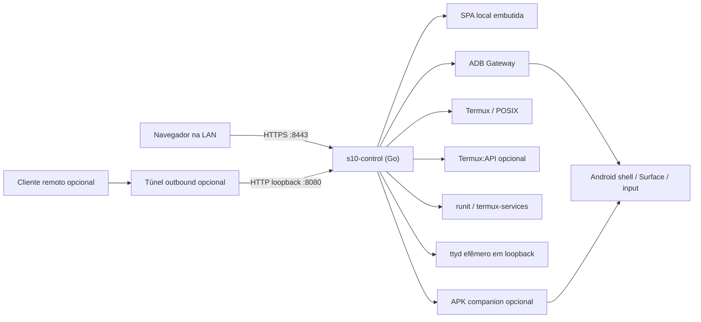

# Arquitetura do S10 Control Server

- **Status:** decisão-base para M0; implementação ainda não iniciada
- **Estilo:** monólito modular, hexagonal/ports-and-adapters, local-first

## 1. Decisão principal

O sistema terá um único backend principal em Go executado no Termux. Ele serve
uma SPA Preact/TypeScript embutida e coordena providers locais. ADB, captura,
controle Android, Termux:API, `ttyd`, runit e túnel são dependências opcionais,
nunca partes do núcleo.

Essa topologia minimiza processos-filho, memória, coordenação e superfície de
falha no Android 12. Microserviços, containers, systemd e banco nativo foram
descartados.



## 2. Princípios

1. **LAN primeiro:** o servidor local é o produto; túnel é apenas transporte
   adicional.
2. **Núcleo independente:** liveness, autenticação, UI e configuração iniciam
   sem ADB, companion, Internet ou túnel.
3. **Capability-driven:** suporte teórico e disponibilidade atual são dimensões
   diferentes.
4. **Providers substituíveis:** toda integração está atrás de um port pequeno e
   testável.
5. **Deny by default:** comandos tipados, allowlists, roots e serviços
   explícitos.
6. **Resultado verificável:** “processo saiu 0” não equivale a “estado mudou”.
7. **Poucos processos:** subprocessos são curtos ou sidecars supervisionados e
   limitados.
8. **Sem reparo destrutivo:** recuperação nunca reinicia o aparelho, revoga ADB,
   desliga rede/SSH ou altera Android crítico.

## 3. Processos e limites de confiança

### 3.1 Processo principal

`s10-control` contém:

- HTTP(S), autenticação e API;
- UI estática embutida;
- registro de capacidades;
- gerenciador de operações e eventos;
- policy engine e auditoria;
- módulos/adapters descritos abaixo.

Ele roda como o UID comum do Termux, sem capabilities Linux adicionais.

### 3.2 Sidecars permitidos

- `sshd`: canal de recuperação existente, totalmente independente e protegido;
- `ttyd`: criado sob demanda somente para o console allowlisted do projeto, em
  loopback; nunca inicia um shell irrestrito;
- `s10-tunnel`: reverse SSH ou cloudflared, opcional e supervisionado;
- `adb`: server/client do pacote `android-tools`, somente quando o provider ADB
  estiver configurado;
- `ffmpeg`: experimento futuro e sob demanda, não baseline de streaming.

Cada sidecar tem timeout, limite de restart e health próprio. A queda de um não
reinicia o telefone nem o processo principal.

“Independente” aqui significa que o lifecycle do projeto não controla `sshd`.
Não é garantia contra o Android: uma morte do app/UID Termux pode derrubar tanto
o servidor quanto SSH, e runit/Boot são somente recuperação best-effort.

### 3.3 APK companion opcional

Um futuro `s10-companion` Android pode oferecer dois serviços independentes:

- `MediaProjection` como ScreenProvider, sempre com consentimento exigido pelo
  Android e foreground notification;
- `AccessibilityService` como AndroidController, habilitado manualmente pelo
  usuário.

O companion não é privilegiado, não recebe root e não é necessário para o
backend. Ele conversa por WebSocket autenticado em `127.0.0.1`, com token local
provisionado e challenge/response. Perder o companion apenas remove suas
capacidades. MediaProjection não inicia silenciosamente após reboot.

## 4. Camadas do backend

| Camada | Responsabilidade | Não pode fazer |
|---|---|---|
| Transport | HTTP(S), SSE, WebSocket, limites, serialização | chamar binários ou Android diretamente |
| Auth/Policy | identidade, papéis, CSRF/origin, allowlists, guardrails | confiar em validação apenas do frontend |
| Application | casos de uso, operações, deadlines, idempotência | conhecer sintaxe de CLI de provider |
| Domain | capacidades, estados, erros, métricas, eventos | importar packages de infraestrutura |
| Ports | contratos de ADB, screen, controller etc. | conter regra específica de fornecedor |
| Adapters | `adb`, POSIX, Termux:API, runit, ttyd, túnel | expor shell arbitrário ao transport |
| Store | configuração, estado, auditoria, retenção | persistir segredos em log ou root editável |

Dependências apontam para dentro: adapter implementa port; domain não conhece
adapter.

## 5. Modelo comum de capacidades

O registro nunca mistura “é possível nesta plataforma?” com “está funcionando
agora?”. O contrato lógico é:

```go
type SupportClass string // guaranteed, probable, experimental, privileged_required
type RuntimeState string // ready, degraded, unavailable, permission_required,
                         // misconfigured, unsupported, unknown

type CapabilityReport struct {
    ID           string
    Support      SupportClass
    State        RuntimeState
    ReasonCode   string
    Detail       string
    Dependencies []string
    ObservedAt   time.Time
    LastSuccess  *time.Time
    RetryAfter   *time.Time
    Stale        bool
}

type Provider interface {
    Probe(context.Context) CapabilityReport
}
```

Exemplo: `screen.snapshot.adb` pode ter suporte `probable` e estado atual
`unavailable` com causa `ADB_OFFLINE`. Reclassificação para `guaranteed` só
ocorre com evidência repetível no SM-G975F registrada em `STATUS.md`; mudança de
estado ocorre em runtime.

## 6. Operações, eventos e erros

Comandos alteradores são assíncronos e auditáveis:

```text
accepted -> queued -> running -> succeeded
                              -> failed
                              -> unsupported
                              -> unverified
                              -> cancelled
                              -> timed_out
```

Toda operação inclui `operationId`, ator, papel, origem, tipo, alvo lógico,
deadline, idempotency key e timestamps. O adapter devolve evidência de execução;
o caso de uso executa uma leitura posterior quando houver estado observável.

Códigos de erro estáveis:

- `UNAVAILABLE`
- `NOT_SUPPORTED`
- `PRIVILEGE_REQUIRED`
- `PERMISSION_REQUIRED`
- `UNAUTHORIZED`
- `FORBIDDEN`
- `POLICY_BLOCKED`
- `INVALID_STATE`
- `STALE_FRAME`
- `TIMEOUT`
- `DEPENDENCY_MISSING`
- `TARGET_MISMATCH`
- `UNVERIFIED`
- `INTERNAL`

Erros externos são sanitizados; stderr completo fica somente em log local com
redaction e limite.

## 7. Contratos por módulo

### 7.1 Backend/core

Componentes internos:

- `app`: wiring e ciclo de vida;
- `api`: transports e schemas;
- `auth`: sessão/token/papéis;
- `policy`: proibições e allowlists;
- `capabilities`: probes, cache e eventos;
- `operations`: fila limitada, cancelamento e idempotência;
- `audit`: NDJSON rotacionado e redaction;
- `store`: JSON atômico e migração explícita;
- `execx`: execução segura de subprocessos, sem shell implícito.

O core oferece health mesmo quando todos os providers opcionais estão ausentes.

### 7.2 Frontend

Interface exclusiva com `/api/v1`; nenhum acesso direto a porta interna.

Responsabilidades:

- dashboard de health e capability reports;
- telas modulares carregadas conforme capacidade;
- estados vazios/degradados com ação de diagnóstico segura;
- acompanhamento de operações e eventos;
- confirmação de ações sensíveis;
- viewport de tela sincronizada a `frameId`, display e rotação.

Sem service worker no início, para evitar controles antigos em cache. Assets e
fontes são locais. A UI nunca habilita botão com base apenas no suporte estático.

### 7.3 ADB Gateway

```go
type ADBClient interface {
    Provider
    Identity(context.Context) (DeviceIdentity, error)
    Shell(context.Context, ADBCommand) (CommandResult, error)
    ExecOut(context.Context, ADBCommand) (io.ReadCloser, error)
    PushManagedAsset(context.Context, ManagedAsset, io.Reader) error
    PullManagedArtifact(context.Context, ManagedArtifact) (io.ReadCloser, error)
}
```

`ADBCommand` é uma união de comandos permitidos, não uma string. Assets e
artefatos usam IDs tipados e caminhos remotos fixos sob a área temporária do
projeto; cliente/API nunca fornece `RemotePath`. O adapter passa argumentos
diretamente ao processo, define serial com `-s` e nunca usa alvo implícito. A
primeira operação após conexão compara modelo, serial lógico e fingerprint com
a identidade cadastrada.

O gateway não oferece pair/tcpip/revoke/reboot. Discovery apenas observa; porta
dinâmica descoberta não é persistida como verdade eterna. Retry tem backoff e
circuit breaker.

### 7.4 Screen Provider

```go
type ScreenProvider interface {
    Provider
    Snapshot(context.Context, SnapshotRequest) (Frame, error)
    OpenStream(context.Context, StreamRequest) (ScreenStream, error)
}

type FrameMeta struct {
    FrameID   string
    Width     int
    Height    int
    Rotation  int
    DisplayID int
    MIME      string
    ObservedAt time.Time
}
```

Providers planejados, na ordem de entrega:

1. `unavailable`: implementação nula e sempre segura;
2. `adb-screencap`: PNG on-demand por `exec-out`, sem fingir vídeo;
3. `scrcpy-h264`: scrcpy-server fixado por versão/checksum, socket ADB e H.264
   retransmitido ao navegador; experimental;
4. `companion-media-projection`: alternativa futura com consentimento.

O cliente gráfico SDL do scrcpy não roda como parte do sistema. O provider usa
somente o servidor/protocolo documentado. H.264 usa WebCodecs quando suportado;
navegador incompatível volta para snapshot. `screenrecord` pode ser probe ou
fallback de laboratório, não streaming permanente.

### 7.5 Android Controller

```go
type AndroidController interface {
    Provider
    Key(context.Context, KeyEvent) OperationResult
    Tap(context.Context, TouchEvent) OperationResult
    Swipe(context.Context, SwipeEvent) OperationResult
    Text(context.Context, TextEvent) OperationResult
    App(context.Context, AppAction) OperationResult
}
```

Adapters:

- `adb-input`: baseline provável, por comandos tipados;
- `scrcpy-control`: experimental, compartilhando a sessão/frame do stream;
- `companion-accessibility`: futuro e manualmente habilitado.

Tap/swipe recebem coordenadas normalizadas e `frameId`; o application service
converte para pixels somente se frame, rotação e display ainda coincidirem.
Tap e swipe sem frame atual são sempre recusados, inclusive para admin. Ações
sem coordenadas, como HOME/BACK, exigem allowlist e confirmação próprias e
continuam bloqueadas quando puderem atingir fluxo destrutivo/lockscreen.

### 7.6 PowerShare

```go
type PowerShareProvider interface {
    Provider
    State(context.Context) (TriState, Evidence, error) // on, off, unknown
    Set(context.Context, bool) OperationResult
}
```

O adapter padrão é nulo. Um futuro `samsung-ui` pode interagir com o tile apenas
após calibração no firmware real, feature flag e pedido explícito. Uma única
tentativa é seguida por leitura independente. Sem evidência confiável, retorna
`unverified`. Sysfs, serviço vendor ou setting não documentado que exija
privilégio não é fallback permitido.

### 7.7 Métricas

```go
type MetricCollector interface {
    Provider
    Describe() []MetricDescriptor
    Sample(context.Context) ([]MetricSample, error)
}

type MetricSample struct {
    Name       string
    Value      float64
    Unit       string
    Source     string
    Quality    string
    ObservedAt time.Time
    Stale      bool
}
```

Coletores independentes:

- `go-process`: uptime, goroutines, heap, GC;
- `termux-posix`: CPU/memória legível e volumes allowlisted;
- `termux-api`: bateria/rede/sensores autorizados;
- `adb-dumpsys`: bateria, memória, thermal/rede quando disponível.

Parsing textual é versionado por fixture. Falha de um coletor não invalida
amostras dos demais. Retenção inicial é buffer em memória mais NDJSON opcional,
com tamanho máximo e rotação.

### 7.8 Rede

```go
type NetworkInspector interface {
    Provider
    Snapshot(context.Context) (NetworkSnapshot, error)
}
```

Somente leitura: interfaces/IPs visíveis, rota default quando acessível,
listeners do próprio UID e probes de LAN/WAN. Não existe método de mutação.
mDNS é um adapter opcional; IP:porta é sempre apresentado.

### 7.9 Acesso remoto

```go
type RemoteAccessProvider interface {
    Provider
    Status(context.Context) TunnelStatus
    Start(context.Context) OperationResult
    Stop(context.Context) OperationResult
}
```

Providers:

- `disabled`: default;
- `reverse-ssh`: baseline provável usando OpenSSH;
- `cloudflared`: opcional, usando pacote Termux e credencial local.

O sidecar conecta somente a `127.0.0.1:8080`, conserva auth do backend e tem
restart budget. `Stop` afeta apenas o sidecar criado pelo projeto. Listener LAN,
Wi-Fi, SSH e DNS local não mudam.

No reverse SSH, `StrictHostKeyChecking` e host key conhecida são obrigatórios;
o bind remoto é `127.0.0.1`, nunca wildcard. Um proxy confiável no host remoto
termina HTTPS antes da exposição pública. O backend aceita `Host`/`Origin`
remotos somente por allowlist e só honra headers `Forwarded`/`X-Forwarded-*` de
proxies cadastrados. Não existe modo público plaintext.

### 7.10 Serviços

```go
type ServiceManager interface {
    Provider
    List(context.Context) []ManagedService
    Status(context.Context, ServiceID) ServiceStatus
    Act(context.Context, ServiceID, ServiceAction) OperationResult
}
```

A allowlist inicial contém:

- `s10-control`: gerenciável externamente apenas por instalação/CLI; o processo
  não tenta parar a si mesmo por uma request comum;
- `s10-tunnel`: start/stop/restart permitido se configurado;
- `sshd`: listado como protegido, status read-only;
- qualquer outro nome: recusado.

O adapter chama `sv` com argumentos fixos. Serviços Android, `adbd`, Wi-Fi e
pacotes não pertencem a este módulo.

### 7.11 Terminal

```go
type TerminalBroker interface {
    Provider
    Open(context.Context, ConsoleProfileID) (TerminalSession, error)
    Resize(context.Context, SessionID, Rows, Cols) error
    Close(context.Context, SessionID) error
}
```

O adapter cria `ttyd` em porta loopback efêmera com comando fixo
`s10control console --profile diagnostics`. Esse console aceita somente ações
read-only/allowlisted do projeto e não interpreta shell. O backend autentica o
admin, gera token interno curto, faz reverse proxy HTTP/WebSocket e encerra a
sessão por idle/max lifetime.

Auditoria registra abertura/fechamento e metadados. Gravação completa da sessão
é desativada por privacidade. Shell Termux irrestrito e terminal Android `shell`
não são oferecidos pelo backend; o proprietário usa o SSH manual existente como
canal break-glass, fora do túnel gerenciado pelo projeto.

### 7.12 Arquivos

```go
type FileService interface {
    Provider
    Roots(context.Context) []FileRoot
    List(context.Context, RootID, RelPath) ([]Entry, error)
    OpenRead(context.Context, RootID, RelPath) (io.ReadCloser, Metadata, error)
    BeginWrite(context.Context, RootID, RelPath) (Upload, error)
    Move(context.Context, RootID, RelPath, RelPath) error
    Trash(context.Context, RootID, RelPath) error
}
```

Roots têm ID, handle aberto, caminho canônico, permissões, quota e limite de
upload. A root padrão é um diretório dedicado `project-share`; home, `.ssh`,
`.android`, configuração/estado do servidor, prefixo Termux, `.git`, chaves,
bancos e segredos nunca são roots, nem mesmo por opt-in, alias ou symlink. Toda
operação é relativa ao handle (`os.Root` quando a
toolchain oferecer, ou equivalente `openat`/no-follow), sem sequência vulnerável
“validar caminho e depois abrir”. Upload ocorre no mesmo filesystem, seguido de
`fsync`/rename atômico quando suportado. Código e bancos nunca executam a partir
de shared storage `noexec`.

## 8. API e protocolos

Superfície inicial planejada:

| Método/rota | Papel | Uso |
|---|---|---|
| `GET /api/v1/health/live` | público mínimo ou viewer | processo vivo, sem dependências |
| `GET /api/v1/health/ready` | viewer | configuração/core prontos |
| `GET /api/v1/capabilities` | viewer | matriz observada |
| `GET /api/v1/events` | viewer | SSE de estados/operações/métricas |
| `POST /api/v1/operations` | operator/admin | união discriminada estrita de ações tipadas |
| `GET /api/v1/operations/{id}` | viewer | resultado/evidência |
| `/api/v1/screen/*` | viewer/operator | snapshot/stream/control separado |
| `/api/v1/terminal/*` | admin | broker e reverse proxy ttyd |
| `/api/v1/files/*` | papel por root | operações confinadas |

O decoder rejeita campos desconhecidos e tipos de operação não registrados.
Contrato REST é OpenAPI em `contracts/openapi.yaml` quando M1 o criar. Eventos
SSE/WS usam envelope com `schemaVersion`, `eventId`, `requestId`, `type`,
`observedAt` e `data`. Mensagem desconhecida é ignorada ou recusada sem fechar o
core.

## 9. Listeners, autenticação e TLS

- `0.0.0.0:8443`: HTTPS LAN, certificado local persistente com fingerprint
  exibido pela CLI;
- `127.0.0.1:8080`: HTTP interno exclusivo do túnel gerenciado; nunca bind em
  interface externa e nunca usado para o console;
- `8022`: convenção SSH do Termux existente, fora do controle do servidor;
- portas `ttyd`: efêmeras e loopback.

Se TLS LAN não puder ser criado, o servidor não faz fallback silencioso para
HTTP externo; permanece loopback e informa erro de configuração.

Cada listener injeta uma classe de ingresso no request context. Rotas de console
são aceitas somente no listener LAN autenticado e recusadas na classe
`remote-tunnel`, mesmo que o túnel alcance o mesmo core. Headers enviados pelo
cliente não podem escolher ou sobrescrever essa classe.

Bootstrap gera token de alta entropia em arquivo modo `0600` e o mostra uma vez
no terminal. A troca cria cookie `Secure`, `HttpOnly`, `SameSite=Strict`; ações
mutáveis exigem CSRF e validação de `Origin`. Papéis:

- `viewer`: health, capacidades, métricas, screen read-only;
- `operator`: controle e operações não administrativas;
- `admin`: configuração, console, roots não sensíveis configuradas e túnel.

Tokens nunca entram em query string, logs, eventos ou Git.

Contrato de autenticação do M1:

- `POST /api/v1/auth/bootstrap/exchange`: consome token one-time com expiração;
- `GET /api/v1/auth/session`: identidade/papel atual;
- `POST /api/v1/auth/logout`: encerra a sessão atual;
- `POST /api/v1/auth/tokens`: admin emite credencial `viewer`/`operator`/`admin`;
- `POST /api/v1/auth/tokens/{id}/rotate`: rotação atômica;
- `DELETE /api/v1/auth/tokens/{id}`: revogação;
- `s10control auth reset`: CLI local/SSH, invalida todas as sessões e emite novo
  bootstrap; nunca é endpoint remoto.

IDs e hashes, nunca tokens em claro, são persistidos. Perder token e SSH não
habilita recuperação remota: exige intervenção manual/DeX, preservando o modelo
de segurança.

## 10. Persistência

Baseline sem banco/CGo:

```text
${HOME}/.config/s10-control/config.json
${HOME}/.local/share/s10-control/state.json
${HOME}/.local/share/s10-control/audit/*.ndjson
${HOME}/.cache/s10-control/
```

Os caminhos reais vêm do ambiente/Termux e são validados; a notação acima é
conceitual. Config/state usam temp file no mesmo diretório, permissões restritas,
`fsync` e rename. Audit é append-only, rotacionado por tamanho/tempo. Métricas
recentes ficam primeiro em ring buffer. Banco só será considerado por ADR após
prova de necessidade e compatibilidade no S10.

## 11. Degradação e prioridade de recursos

| Evento | Estado/fallback |
|---|---|
| ADB indisponível | adapters ADB abrem circuito; módulos locais continuam |
| scrcpy falha | fecha socket/processo, volta a PNG; depois unavailable |
| WebCodecs ausente | snapshot, sem transcodificação obrigatória |
| companion sai | remove somente capacidades companion |
| Termux:API falha | mantém métricas Go/POSIX e, se houver, ADB |
| túnel falha | LAN não muda; sidecar usa restart budget/backoff |
| shared storage revogada | root compartilhada desaparece; `project-share` permanece |
| ttyd ausente | console web unavailable; SSH manual permanece fora do core |
| pressão térmica/CPU | pausa vídeo, reduz polling, preserva auth/health |
| fila cheia | rejeita nova operação com backpressure; não cresce sem limite |

Prioridade de sobrevivência: autenticação/health > LAN/API > auditoria > arquivos
e serviços > métricas > snapshot > stream/transcodificação.

## 12. Dependências escolhidas

### 12.1 Pacotes Termux

| Pacote/app | Papel | Classe |
|---|---|---|
| `ca-certificates`, `git` | bootstrap/versionamento | requerido para desenvolvimento |
| `golang` | build do backend ARM64/Bionic | build-only no aparelho |
| `nodejs-lts` | build do frontend | build-only |
| `android-tools` | cliente/server ADB | opcional por capacidade |
| `openssh` | recuperação e reverse SSH | requerido operacional; protegido |
| `termux-services` | supervisão runit | requerido operacional |
| `ttyd` | UI do console allowlisted em loopback | opcional, terminal |
| `termux-api` + APK correspondente | bateria/rede/wakelock | opcional; mesma origem/assinatura |
| Termux:Boot APK | start best-effort | opcional; mesma origem/assinatura |
| `cloudflared` | túnel alternativo | opcional |
| `ffmpeg` | laboratório de mídia | experimental, não baseline |

Usar somente repositório oficial Termux compatível com a origem do app. Não
misturar APKs F-Droid/GitHub/Play por causa das assinaturas.

### 12.2 Backend Go

- standard library: HTTP, TLS, JSON, crypto, `slog`, embed e testes;
- `github.com/coder/websocket`: WebSocket quando screen/terminal exigirem;
- nenhuma ORM, SQLite, CGO ou framework HTTP no baseline;
- versão exata e hashes entram em `go.mod`/`go.sum` no M1, depois de `go env` e
  build no Termux real.

### 12.3 Frontend

- TypeScript;
- Vite;
- Preact;
- APIs nativas Fetch, EventSource e WebCodecs; `@xterm/xterm` não é necessário
  enquanto o frontend do `ttyd` for usado;
- versões ficam presas em `package-lock.json` quando M1 criar o app.

### 12.4 Companion Android

Kotlin + Android SDK/AndroidX mínimos, build em workstation/CI Android (não como
dependência do runtime Termux). `minSdk` e versões só serão fixados após o probe
do firmware. Nenhum SDK Samsung privado será incorporado sem ADR e licença.

## 13. Build e distribuição

1. Vite gera assets estáticos, sem recursos remotos.
2. O backend incorpora `dist/` via `go:embed`.
3. O binário é compilado no próprio Termux ou em toolchain Android/NDK
   equivalente; `GOOS=linux`/glibc genérico não é artefato válido.
4. CI de host executa unit/contract tests; o S10 executa build, integração e
   smoke tests.
5. Release inclui checksums, SBOM simples, instruções de rollback e nunca inclui
   configuração/segredos.

Não haverá manifesto de dependências fictício no M0. O próximo milestone cria e
valida os lockfiles.

## 14. Estrutura do repositório

```text
apps/
  server/
    cmd/s10control/
    internal/{api,app,audit,auth,capabilities,operations,policy,store,execx}/
    internal/modules/{adb,screen,controller,powershare,metrics,network}/
    internal/modules/{remote,services,terminal,files}/
  web/
    src/{app,features,lib}/
  companion/
contracts/
config/
deploy/termux/{boot,runit}/
docs/{adr,operations,research,testing}/
scripts/
tests/{contract,integration,device}/
```

Os diretórios são fronteiras, não microserviços. `contracts` é a única fonte de
tipos de transporte entre backend e frontend.

## 15. Estratégia de teste

- domain/application: fakes de todos os ports, sem telefone;
- policy: tabela negativa obrigatória para cada comando proibido;
- contract: OpenAPI/envelopes e códigos de erro;
- integration: binários falsos em `PATH` controlado, timeouts e saída excessiva;
- Termux: build ARM64, permissões, runit, TLS e LAN offline;
- S10: testes manuais/automatizados seguros definidos por milestone em
  `PLAN.md`, sempre registrando build/firmware/evidência.

Testes destrutivos não existem. Falhas reais são simuladas por adapters ou
configuração inválida, não desligando Wi-Fi/SSH ou revogando ADB.
